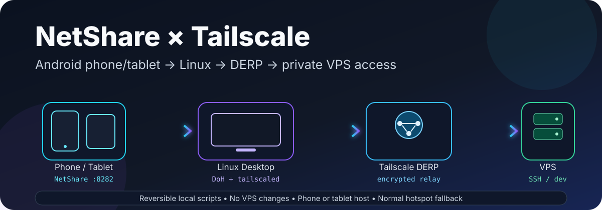
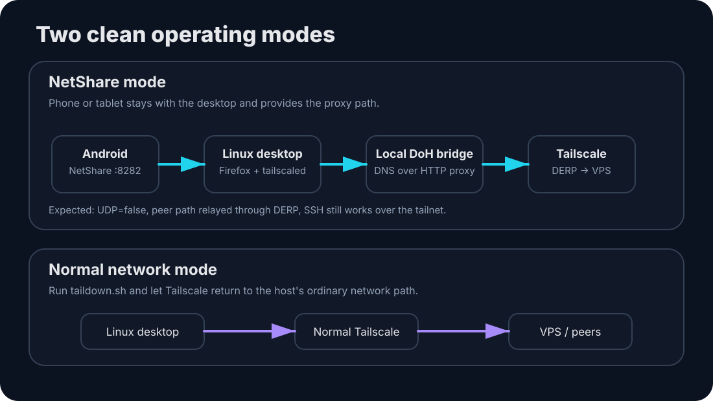

<p align="center">
  
</p>

<p align="center">
  <strong>Use an Android phone or tablet running NetShare to keep a Linux desktop online — including Tailscale/SSH access to private VPS hosts — without changing the VPS configuration.</strong>
</p>

<p align="center">
  
  
  
  
</p>

> [!NOTE]
> This is a practical personal setup for proxying a Linux desktop through **NetShare on either a phone or a tablet**. It is intentionally designed so the VPS side stays untouched.

## Why this exists

NetShare can give a Linux desktop internet access through an Android device, but it behaves more like a proxy path than a fully routed connection. That means ordinary web browsing can work while things that expect direct DNS or UDP — such as QUIC/HTTP3 and direct WireGuard paths — may not.

This repo wraps the awkward parts in a few small scripts:

- Firefox is configured for the NetShare proxy and remote DNS.
- HTTP/3 is disabled so Firefox falls back to TCP-based HTTP/2/HTTP/1.1.
- Tailscale gets a temporary HTTP proxy override.
- A temporary local DNS-over-HTTPS bridge gives `tailscaled` working DNS through the same NetShare proxy.
- When direct UDP is unavailable, Tailscale can use **DERP** as its relay path.
- `taildown.sh` removes the temporary NetShare-specific changes and returns the machine to its normal Tailscale setup.

<p align="center">
  
</p>

## Repo layout

```text
netshare-tailscale-bridge/
├── README.md
├── netshare-setup.sh
├── tailup.sh
├── taildown.sh
└── assets/
    ├── banner.svg
    └── architecture.svg
```

## Assumptions

The defaults in these scripts assume the common NetShare hotspot layout:

```text
NetShare host: 192.168.49.1
Desktop:       192.168.49.x
Proxy port:    8282
```

The Android host can be a **phone or a tablet**. If your NetShare address or port differs, edit the variables at the top of the scripts or use the supported environment overrides where noted.

## 1. One-time desktop setup

Make the scripts executable:

```bash
chmod +x *.sh
```

Run:

```bash
./netshare-setup.sh
```

The setup script handles the stable desktop-side pieces, including Firefox configuration. It is intended to:

- set the NetShare proxy
- use proxy-side DNS from Firefox
- enable Firefox fingerprint resistance
- disable HTTP/3/QUIC for compatibility with the proxy path
- install the persistent TTL rule used by this setup
- locate the default Firefox profile via `profiles.ini` when possible

Restart Firefox after the setup script changes its profile preferences.

## 2. Confirm NetShare itself

With the Linux desktop connected to the Android NetShare hotspot:

```bash
curl -x http://192.168.49.1:8282 https://api.ipify.org
```

A public mobile IP means the HTTP CONNECT path works.

The same NetShare endpoint may also accept SOCKS5:

```bash
curl --proxy socks5h://192.168.49.1:8282 https://api.ipify.org
```

This project uses **HTTP CONNECT for Tailscale** because that is the cleanest fit for `tailscaled`.

## 3. Bring Tailscale up over NetShare

```bash
./tailup.sh piper
```

Replace `piper` with any Tailscale hostname you want the script to test.

`tailup.sh`:

1. finds the interface used to reach the Android device
2. confirms Tailscale HTTPS is reachable through NetShare
3. starts a temporary local DNS-over-HTTPS bridge
4. temporarily points that NetShare link's DNS at the local bridge
5. installs an isolated `tailscaled` systemd proxy drop-in
6. restarts Tailscale
7. prints `tailscale status`
8. runs `tailscale netcheck` and `tailscale ping`

If Tailscale reports that the machine is logged out, authenticate once using the URL it prints, then check:

```bash
tailscale status
tailscale ping piper
```

A result such as:

```text
pong from piper (...) via DERP(nyc)
```

is a success.

On this kind of NetShare connection, this is also expected:

```text
UDP: false
```

The point is not to force a direct WireGuard path. The point is to give Tailscale a working control/DNS path and let DERP carry the encrypted tailnet traffic when direct UDP is unavailable.

## 4. SSH normally

Once the peer is reachable through Tailscale:

```bash
ssh user@piper
```

or:

```bash
ssh user@100.x.y.z
```

No alternate SSH port, VPS proxy daemon, or VPS firewall change is required by this project.

## 5. Return to normal networking

Run:

```bash
./taildown.sh
```

You can run it **before or after switching away from NetShare**.

It removes only the temporary NetShare-specific pieces created by `tailup.sh`:

- the temporary per-link DNS override
- the temporary DNS-over-HTTPS bridge
- the dedicated `tailscaled` systemd proxy drop-in

Then it restarts `tailscaled` normally.

If the desktop is still connected only through NetShare after `taildown.sh`, Tailscale may be offline until you reconnect to a normally routed network. That is expected.

## Phone vs. tablet

Both work.

### Phone

Useful when the phone is already your mobile-data source and stays near the desktop.

### Tablet

Often better for long-running development or agentic coding because the tablet can remain with the desktop while you take your phone with you.

That gives you a persistent setup like:

```text
Android tablet
    │
    └── NetShare
          │
          ▼
Linux desktop
    ├── Firefox / VS Code / local tools
    └── Tailscale → DERP → VPS
                          ├── tmux
                          ├── Hermes
                          └── Codex / dev tools
```

## What this project changes

**On the Linux desktop:**

- Firefox profile preferences
- a persistent TTL rule from the desktop setup script
- temporary `systemd-resolved` link settings while `tailup.sh` is active
- a temporary local DoH helper while `tailup.sh` is active
- a dedicated Tailscale systemd drop-in while `tailup.sh` is active

**On the VPS:**

```text
Nothing.
```

That is deliberate.

## Verification

While NetShare mode is active:

```bash
tailscale status
tailscale ping piper
tailscale netcheck
```

A healthy constrained-NetShare result can look like:

```text
piper ... active; relay "nyc"
```

and:

```text
pong from piper (...) via DERP(nyc)
```

with:

```text
UDP: false
```

That combination means the direct path is unavailable but the relay path is working.

## Troubleshooting

<details>
<summary><strong>Tailscale says it cannot resolve controlplane.tailscale.com</strong></summary>

The NetShare proxy can carry HTTP/HTTPS while the Linux system resolver may still be trying normal DNS directly.

`tailup.sh` solves this by running a temporary local DNS-over-HTTPS bridge whose outbound HTTPS request itself goes through NetShare.

</details>

<details>
<summary><strong>Firefox browsing works but streaming does not</strong></summary>

Some streaming sites prefer HTTP/3/QUIC, which uses UDP. The NetShare proxy path in this setup works better with TCP.

The setup script disables Firefox HTTP/3 so Firefox falls back to HTTP/2 or HTTP/1.1.

</details>

<details>
<summary><strong>tailscale netcheck says UDP: false</strong></summary>

That is expected on this proxy-style NetShare path.

If `tailscale ping <peer>` succeeds via DERP, the setup is doing its job.

</details>

<details>
<summary><strong>I ran taildown.sh while still on NetShare</strong></summary>

That is okay.

The script removes the NetShare-specific Tailscale/DNS helpers. Tailscale may then remain offline until the desktop gets a normal routed internet connection again.

</details>

<details>
<summary><strong>My Android device uses a different NetShare IP or port</strong></summary>

Update the defaults in the scripts.

For the Tailscale script, you can also launch with environment overrides:

```bash
NETSHARE_IP=192.168.49.1 NETSHARE_PORT=8282 ./tailup.sh piper
```

</details>


## Optional app add-ons

Some desktop applications do not honor `HTTP_PROXY` / `HTTPS_PROXY` reliably, or use separate networking stacks for persistent connections such as WebSockets.

Application-specific recipes live under:

```text
addons/
```

### Buzz Desktop 🐝

Buzz Desktop can download normal HTTPS resources through NetShare while its relay connection still fails. The Buzz add-on launches the AppImage through ProxyChains-NG so its secure WebSocket relay traffic follows the NetShare proxy path.

```text
addons/
└── buzz/
    ├── README.md
    ├── buzz-netshare.sh
    └── proxychains-buzz.conf
```

See [`addons/buzz/README.md`](addons/buzz/README.md) for setup, relay verification, troubleshooting, and launch options.

This add-on is deliberately **not part of the core networking setup**. It does not modify Tailscale, Firefox, SSH, or either VPS.

## Security notes

The design goal is to avoid weakening the VPS just to accommodate a constrained client network.

The VPS keeps its existing:

- SSH configuration
- firewall rules
- Tailscale identity
- ACLs / grants
- private tailnet addressing

When Tailscale uses DERP, the relay is the transport path; the tailnet connection remains encrypted between Tailscale peers.

This project does **not** attempt to make Tailscale itself invisible to the network provider.

## A tiny bit of philosophy

Sometimes the cleanest network fix is not to make the constrained connection pretend to be a normal one.

This setup accepts the limitations:

```text
No normal UDP?  Fine.
No ordinary DNS path?  Bridge it.
Direct WireGuard unavailable?  Use DERP.
Don't want to touch the VPS?  Don't.
```

That makes the whole thing surprisingly dependable — and easy to undo.

## License

Add whichever license fits how you want to share the project. MIT is a simple choice if you want others to use, modify, and redistribute the scripts with attribution.
